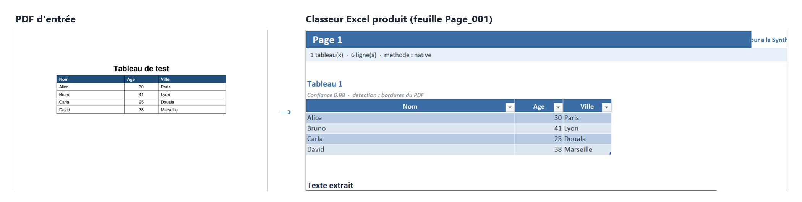

# ArchivIA

[](https://github.com/Ledur06/archivia/actions/workflows/ci.yml)


**Transformer un fonds d'archives papier en donnees exploitables.**

Les convertisseurs PDF vers Excel du marche supposent des documents propres. Les archives reelles ne le sont pas : tableaux a bordures faibles, pages inclinees, photocopies de photocopies, tableaux qui se poursuivent sur quinze pages. ArchivIA est concu pour ce cas-la.

En entree, un PDF natif ou scanne. En sortie, un classeur Excel filtrable et type, ou chaque ligne conserve la trace de sa page d'origine, accompagne d'un controle qualite qui signale les zones incertaines plutot que de faire semblant d'etre sur.

Le projet est ne d'un constat de terrain : en stage, la structuration d'archives administratives se fait encore a la main, et les moteurs d'OCR generiques s'effondrent des qu'ils quittent le PDF de demonstration.

## En un coup d'oeil

```bash
python -m pdf_excel_converter document.pdf --output-dir resultats
```



Le classeur produit contient :

| Feuille | Contenu |
|---|---|
| `Synthese` | Vue d'ensemble du document, avec liens vers chaque page |
| `Page_1`, `Page_2`, ... | Tableaux natifs Excel, filtrables, cellules typees (nombres, dates, pourcentages) |
| `Tableaux_fusionnes` | Tableaux reconstitues quand ils se poursuivent sur plusieurs pages (`--smart-merge`) |
| `Controle_qualite` | Pages vides, extractions douteuses, zones a verifier manuellement |

Un exemple minimal reproductible est fourni : `pytest -v` traite `tests/sample.pdf` de bout en bout.

## Ce qui distingue ArchivIA d'un convertisseur classique

- **Reconstitution des tableaux longs** : un tableau etale sur quinze pages redevient un tableau continu, en-tetes repetes supprimes.
- **Tracabilite** : chaque ligne exportee conserve sa page d'origine. Pour une administration, l'auditabilite compte autant que le resultat.
- **Aveu d'incertitude** : l'outil ne pretend jamais etre sur. Toute page ambigue, vide ou mal extraite est signalee dans `Controle_qualite`.
- **Detection de grille par traitement d'image** sur les scans, la ou un simple regroupement par position de mots echoue.
- **Fonctionnement integralement hors ligne** : aucune dependance a un service externe dans le mode par defaut. Le mode `--use-claude` est optionnel, et bascule automatiquement sur le moteur local en cas d'echec.

## Deux moteurs d'extraction

1. **Local** (par defaut, gratuit, hors ligne) : `pdfplumber` + OCR Tesseract + detection de grille par traitement d'image pour les tableaux scannes.
2. **Claude API** (optionnel, `--use-claude`) : chaque page est lue directement par Claude (vision), qui renvoie une structure fidele. Plus robuste face a des mises en page complexes ou des scans de mauvaise qualite, mais necessite une cle API payante et une connexion. Voir la section Confidentialite avant tout usage sur documents sensibles.

## Statut du projet

Version utilisable en ligne de commande, pas encore produit. Le pipeline tourne de bout en bout : traitement par lot, reprise d'extraction depuis JSON, export Excel et JSON, diagnostics.

Prochaines etapes : interface web (aujourd'hui un terminal est necessaire, ce qui exclut l'utilisateur non technique), couverture de tests etendue aux modules d'analyse et d'export, puis entrainement d'un modele specialise sur les mises en page administratives locales a partir des corrections utilisateurs.

## Tests

```bash
pytest -v          # tests unitaires du module d'extraction
python smoke_test.py --help   # test de bout en bout sur un document reel
```

La couverture actuelle porte sur `pdf_extract` et sur un smoke test global. L'extension aux modules `analyzer`, `table_vision` et `export_excel` est en cours.

## Fonctionnalites

- Lecture de PDF natifs avec texte selectionnable.
- Extraction geometrique des tableaux avec `pdfplumber` (bordures reelles, alignement de texte, position des mots - trois niveaux de detection en cascade).
- Fallback texte avec `pypdf` si `pdfplumber` est absent.
- OCR pour les PDF scannes, avec reconstruction de tableau par detection de grille de lignes reelle (plus fiable qu'un simple regroupement par position de mots sur un tableau a bordures).
- Structuration systematique par l'API Claude (`--use-claude`), page par page, avec repli automatique sur l'extraction locale si l'appel echoue.
- Reorganisation intelligente document-entier (`--smart-merge`) : fusion des tableaux qui continuent sur plusieurs pages, regroupement des tableaux de meme nature, dans une feuille dediee en plus des feuilles par page.
- Cellules Excel typees (nombres, dates, pourcentages avec le bon format), pas seulement du texte brut.
- Tableaux Excel natifs filtrables et stylises (plusieurs par feuille, chacun independant).
- Detection et suppression des en-tetes de tableau repetes (tableau continu sur plusieurs pages).
- Liens de navigation entre la feuille `Synthese` et chaque page.
- Rechargement d'une extraction deja faite avec `--from-json` (regenere l'Excel sans refaire l'OCR).
- Traitement par lot d'un dossier entier avec `--batch-dir`.
- Code de sortie non nul avec `--strict` pour detecter automatiquement les documents a verifier (utile en automatisation).
- Selection de pages avec `--pages`.
- Choix du contenu avec `--mode tables`, `--mode text` ou `--mode both`.
- Recherche automatique de Tesseract et Poppler dans le systeme ou dans un dossier portable.

## Lancement Windows

Depuis PowerShell, dans le dossier du projet :

```powershell
.\Convert-PDFToExcel.ps1 -PdfPath "C:\chemin\document.pdf"
```

Avec OCR :

```powershell
.\Convert-PDFToExcel.ps1 -PdfPath "C:\chemin\document_scanne.pdf" -Ocr
```

Avec chemins OCR explicites :

```powershell
.\Convert-PDFToExcel.ps1 -PdfPath "C:\chemin\document_scanne.pdf" -Ocr -TesseractPath "C:\Program Files\Tesseract-OCR" -PopplerBin "C:\poppler\Library\bin"
```

Pages specifiques :

```powershell
.\Convert-PDFToExcel.ps1 -PdfPath "C:\chemin\document.pdf" -Pages "1,3,5-7"
```

Tableaux uniquement :

```powershell
.\Convert-PDFToExcel.ps1 -PdfPath "C:\chemin\document.pdf" -Mode tables
```

Test rapide :

```powershell
.\Convert-PDFToExcel.ps1 -PdfPath "C:\chemin\document.pdf" -MaxPages 10
```

Le lanceur PowerShell ne couvre pas encore `--use-claude` / `--from-json` / `--batch-dir` / `--strict` : pour ces options, utilisez directement `python -m pdf_excel_converter` (voir plus bas).

## Lancement Linux / Mac

Rendre le script executable une fois :

```bash
chmod +x convert.sh
```

Conversion simple :

```bash
./convert.sh --pdf chemin/document.pdf
```

Avec OCR :

```bash
./convert.sh --pdf chemin/document_scanne.pdf --ocr
```

Pages specifiques :

```bash
./convert.sh --pdf chemin/document.pdf --pages "1,3,5-7"
```

Mode tableaux uniquement :

```bash
./convert.sh --pdf chemin/document.pdf --mode tables
```

## Utilisation directe (toutes plateformes, toutes options)

```bash
python -m pdf_excel_converter "document.pdf" --output-dir outputs/excel
```

Rechargement d'un JSON deja extrait (regenere l'Excel sans refaire l'extraction) :

```bash
python -m pdf_excel_converter --from-json outputs/excel/document_extraction.json
```

Traitement par lot d'un dossier :

```bash
python -m pdf_excel_converter --batch-dir mon_dossier --output-dir outputs/excel --ocr
```

Verification stricte (code de sortie 2 si des pages/tableaux necessitent une revue manuelle) :

```bash
python -m pdf_excel_converter "document.pdf" --strict
```

## Structuration par l'API Claude (`--use-claude`)

Envoie l'image de CHAQUE page a Claude, qui la lit et renvoie une structure JSON fidele (tableaux + texte). Fonctionne de la meme maniere quel que soit le type de document (natif ou scanne, propre ou de mauvaise qualite) : c'est Claude qui lit la page, pas une heuristique locale.

### Mise en place (une seule fois)

1. Creer un compte sur https://console.anthropic.com et ajouter un moyen de paiement (Settings -> Billing). **Un paiement est requis des le premier appel** : il n'y a plus de credit gratuit garanti a l'inscription. Fixez un plafond de depense mensuel bas dans Billing pour eviter toute surprise.
2. Creer une cle API (Settings -> API Keys -> Create Key). Elle ne s'affiche qu'une fois : copiez-la immediatement dans un endroit sur (jamais dans un fichier partage/commite).
3. Installer la dependance : `pip install -r requirements.txt` (inclut desormais `anthropic`).
4. Definir la cle comme variable d'environnement :
   - PowerShell (session courante) : `$env:ANTHROPIC_API_KEY="sk-ant-..."`
   - PowerShell (permanent) : `setx ANTHROPIC_API_KEY "sk-ant-..."` puis rouvrir le terminal.
   - Linux/Mac : `export ANTHROPIC_API_KEY="sk-ant-..."`

### Utilisation

```bash
python -m pdf_excel_converter "document.pdf" --use-claude --output-dir outputs/excel
```

Options :

| Argument | Role |
|---|---|
| `--use-claude` | Active la structuration Claude, systematique sur toutes les pages traitees |
| `--claude-model` | Modele a utiliser, par defaut `claude-haiku-4-5-20251001` (rapide, economique) |
| `--claude-dpi` | Resolution de l'image envoyee a Claude (150 par defaut, monter augmente le cout) |

A la fin du traitement, l'outil affiche le nombre de pages structurees par Claude et une estimation de cout (indicative - se referer a la console Anthropic pour la facturation exacte).

### Cout indicatif (Claude Haiku 4.5, tarifs a la redaction de ce document)

- Document de 3 pages : environ $0.02.
- Document de 200 pages : environ $1.50.

Le modele `claude-sonnet-5` (plus precis, plus cher, ~3-4x le cout de Haiku) peut etre choisi via `--claude-model claude-sonnet-5` sur un document particulierement difficile.

### Confidentialite

Par defaut, Anthropic n'utilise pas les documents envoyes via l'API pour entrainer ses modeles (opt-in uniquement), et les supprime automatiquement sous 30 jours (conserves uniquement a des fins de detection d'abus). Une suppression immediate ("Zero Data Retention") existe mais necessite un accord commercial specifique aupres d'Anthropic - pas disponible en libre-service pour un compte individuel. **Ne pas utiliser `--use-claude` sur un document contenant des donnees sensibles (nominatives, financieres, medicales...) sans avoir verifie que cela respecte vos obligations de confidentialite.**

### Fiabilite

Si l'appel Claude echoue pour une page (reseau, cle invalide, quota depasse, reponse malformee), l'outil se rabat automatiquement sur l'extraction locale pour CETTE page uniquement et l'indique dans un avertissement - le reste du document continue d'etre traite normalement.

## Reorganisation intelligente (`--smart-merge`)

Une fois toutes les pages extraites (localement ou via `--use-claude`, peu importe), cette option ajoute une passe **document entier** : Claude etudie un resume de tous les tableaux deja extraits (en-tetes, nombre de colonnes, quelques lignes d'exemple - jamais les images des pages, donc beaucoup moins cher qu'une nouvelle passe `--use-claude`) et decide :

- quels tableaux sont en realite la continuation d'un seul et meme tableau sur des pages consecutives (fusion en un tableau unique, en-tetes repetes dedupliques) ;
- quels tableaux, sans se suivre, portent sur le meme sujet et gagnent a etre presentes ensemble (regroupement sans fusion, colonnes conservees telles quelles) ;
- un titre et une categorie parlants pour chaque groupe.

Le resultat s'ajoute dans une nouvelle feuille `Tableaux_consolides`, **sans jamais modifier ni supprimer** les feuilles `Page_XXX` existantes : c'est une vue en plus, pas un remplacement. Si l'appel echoue (reseau, reponse malformee), l'outil l'indique dans un avertissement et le reste du fichier reste inchange.

Tracabilite - tout est marque, rien n'est fondu silencieusement :

- Un badge **FUSIONNE** ou **REGROUPE** identifie immediatement le type de chaque groupe.
- Une phrase de Claude explique **pourquoi** ces tableaux ont ete rapproches (ex : "Meme en-tete et suite logique des lignes entre les pages 3 et 4").
- Un tableau fusionne recoit une colonne **"Page source"** sur chaque ligne : on sait toujours de quelle page venait chaque donnee, meme apres fusion.
- Un groupe simplement regroupe (tableaux distincts) rappelle la page d'origine de chaque tableau individuellement.
- Des cartes indicateurs (KPI) sur `Synthese` et sur `Tableaux_consolides` : nombre de groupes, tableaux fusionnes, tableaux regroupes, tableaux d'origine impliques, pages couvertes.

```bash
python -m pdf_excel_converter "document.pdf" --use-claude --smart-merge --output-dir outputs/excel
```

Fonctionne aussi avec un JSON deja extrait, sans refaire l'extraction :

```bash
python -m pdf_excel_converter --from-json outputs/excel/document_extraction.json --smart-merge
```

Necessite `ANTHROPIC_API_KEY` (meme cle que `--use-claude`). Modele par defaut : `claude-sonnet-5` (meilleur jugement pour ce type de decision organisationnelle que Haiku) - configurable avec `--reorg-model`.

### Cout indicatif de `--smart-merge`

Un seul appel API par document (pas un par page), texte seul (pas d'images) : le cout depend du nombre de tableaux, pas du nombre de pages.

- Document avec une dizaine de tableaux : quelques centimes.
- Document de 200+ pages avec plusieurs centaines de tableaux (245 tableaux sur un document de test) : environ +0.30 a 0.40 $ avec Sonnet, en plus du cout de `--use-claude`.

## Arguments principaux

| Argument | Valeurs | Role |
|---|---|---|
| `--pages` / `-Pages` | `1`, `1,3`, `2-5`, `1,3,10-15` | Selectionne les pages a traiter |
| `--mode` / `-Mode` | `tables`, `text`, `both` | Choisit tableaux, texte ou les deux |
| `--ocr` / `-Ocr` | actif/inactif | Active l'OCR local pour pages scannees |
| `--ocr-lang` / `-OcrLang` | `fra+eng`, `eng`, etc. | Langues Tesseract |
| `--ocr-dpi` | nombre | Resolution de rendu avant OCR local (300 par defaut) |
| `--max-pages` / `-MaxPages` | nombre | Traite seulement les N premieres pages |
| `--output-dir` / `-OutputDir` | chemin | Dossier de sortie |
| `--from-json` | chemin JSON | Regenere l'Excel depuis une extraction deja faite |
| `--batch-dir` | dossier | Traite tous les PDF d'un dossier a la suite |
| `--strict` | actif/inactif | Code de sortie non nul si qualite douteuse |
| `--use-claude` | actif/inactif | Structuration systematique par l'API Claude |
| `--claude-model` | nom de modele | Modele Claude a utiliser |
| `--claude-dpi` | nombre | Resolution image envoyee a Claude |
| `--smart-merge` | actif/inactif | Reorganisation document-entier (fusion/regroupement de tableaux) |
| `--reorg-model` | nom de modele | Modele Claude pour `--smart-merge`, par defaut `claude-sonnet-5` |

## Sorties generees

Par defaut sous Windows, les fichiers sont crees dans :

```text
C:\Users\<utilisateur>\Documents\PDF_EXCEL_OUTPUT
```

Chaque conversion produit :

- `nom_du_pdf_extrait.xlsx` : classeur Excel final ;
- `nom_du_pdf_extraction.json` : structure technique extraite (reutilisable avec `--from-json`).

Le classeur Excel contient :

- `Synthese` : resume de la conversion, avec liens vers chaque page ;
- `Tableaux_consolides` (uniquement avec `--smart-merge`) : tableaux fusionnes multi-pages et regroupements thematiques decides par Claude ;
- `Page_001`, `Page_002`, etc. : contenu extrait par page, tableaux en tableaux Excel natifs (filtrables), texte libre en paragraphes ;
- `Metadonnees` : source, date, version, statistiques ;
- `Controle_qualite` : pages et tableaux a verifier, avec avertissements et liens de navigation.

## Diagnostic

```bash
python -m pdf_excel_converter --diagnose
```

Le diagnostic indique l'etat reel de `pytesseract`, Tesseract, `pdf2image` et Poppler.

## Smoke test

```bash
python smoke_test.py
```

Ce test cree un PDF echantillon reel dans `tests/sample.pdf`, l'extrait, puis genere Excel et JSON.

```bash
python -m pytest tests/
```

Tests unitaires cibles sur la logique de detection/classification.

## OCR local et dependances systeme

L'OCR local requiert deux composants externes :

- Tesseract OCR ;
- Poppler (`pdftoppm`).

Ils peuvent etre installes sur l'ordinateur ou places dans un dossier portable comme decrit dans `USB_REQUIREMENTS.md`.

Tesseract et Poppler ne s'installent pas avec `pip`. `pytesseract` et `pdf2image` sont seulement des wrappers Python.

- Tesseract Windows : https://github.com/UB-Mannheim/tesseract/wiki
- Poppler Windows : https://github.com/oschwartz10612/poppler-windows/releases

La detection de grille de tableau sur les scans (OpenCV) est optionnelle : sans `opencv-python-headless` et `numpy` installes, l'outil se rabat automatiquement sur une methode moins fiable (position des mots), sans planter.

Si le dossier du projet contient des caracteres speciaux et que `pip install -r requirements.txt` affiche des erreurs d'encodage, utilisez :

```powershell
$tmpReq = Join-Path $env:TEMP "pdf_excel_converter_requirements.txt"
Copy-Item ".\requirements.txt" $tmpReq -Force
python -m pip install --user --progress-bar off --disable-pip-version-check -r $tmpReq
```

## Limites connues

- Les scans exigent Tesseract + Poppler installes separement ou fournis en portable (sauf en mode `--use-claude`, qui n'en a pas besoin).
- La detection de grille sur un scan de mauvaise qualite (bordures faibles, page tres inclinee) peut encore fusionner par erreur deux colonnes adjacentes - un avertissement est alors ajoute pour verification manuelle.
- Les cellules fusionnees complexes en detection locale (hors `--use-claude`) sont reconstruites par "remplissage" de la valeur sur les lignes/colonnes couvertes, pas par une vraie fusion visuelle Excel.
- `--use-claude` necessite une connexion internet et une cle API payante.

## Fichiers importants

- `Convert-PDFToExcel.ps1` : lanceur Windows.
- `convert.sh` : lanceur Linux/Mac.
- `pdf_excel_converter/` : code Python de conversion.
- `requirements.txt` : dependances Python.
- `USB_REQUIREMENTS.md` : guide pour transferer l'outil sur une cle USB.
- `CODE_DOCUMENTATION.md` : explication du code.
